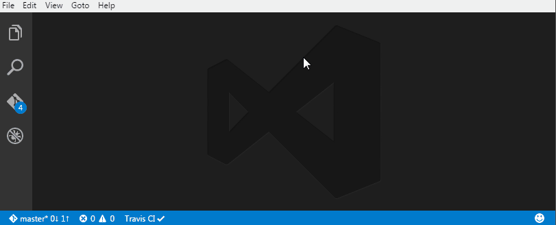

# Start any shell

Start any shell from Visual Studio Code, configurable from your user settings.

It will start in the currently opened folder, or when no folder is open, it will start in the folder of the active file. 
 
## Usage 



For now, starting a shell is a two-step process:

- Fire the 'Start Shell' command from the command palette (or use the default shortcut 'ctrl+shift+c')
- Launch any of the predefined or custom shells (see configuration section below)

> It is not possible (that I know of) for an extension to dynamically register a top-level command.
> VsCode only reads commands from the extension manifest on startup.

## Configuration

Open your user settings and copy the shell commands you would like to use, or create your own:

```json
	// Shell commands, see default for examples.
	"startanyshell.shells": [
        {
            "description": "Windows Command Prompt",
            "command": "start \"%description%\" /WAIT %comspec%"
        },
        {
            "description": "Git Bash 2",
            "command": "\"C:\\Program Files\\Git\\git-bash.exe\" \"--cd=%path%\""
        },
        {
            "description": "Windows Powershell",
            "command": "start \"%description%\" powershell.exe -noexit"
        },
        {
            "description": "Developer Command Prompt for VS2015",
            "command": "start \"%description%\" /WAIT \"%HOMEDRIVE%\\Program Files (x86)\\Microsoft Visual Studio 14.0\\Common7\\Tools\\VsDevCmd.bat\""
        },
        {
            "description": "Cmder",
            "command": "cmder.exe /start \"%path%\""
        }
    ]
```

## Usage 

Open the command palette (F1 / Ctrl+Shift+P), and look for 'Start shell'. Or use the shortcut 'ctrl+shift+c'.

## License

[MIT](LICENSE)